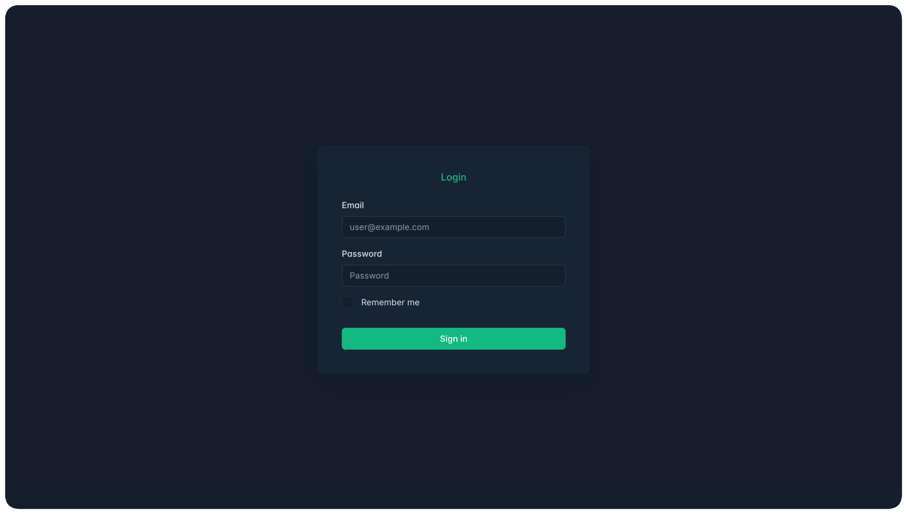
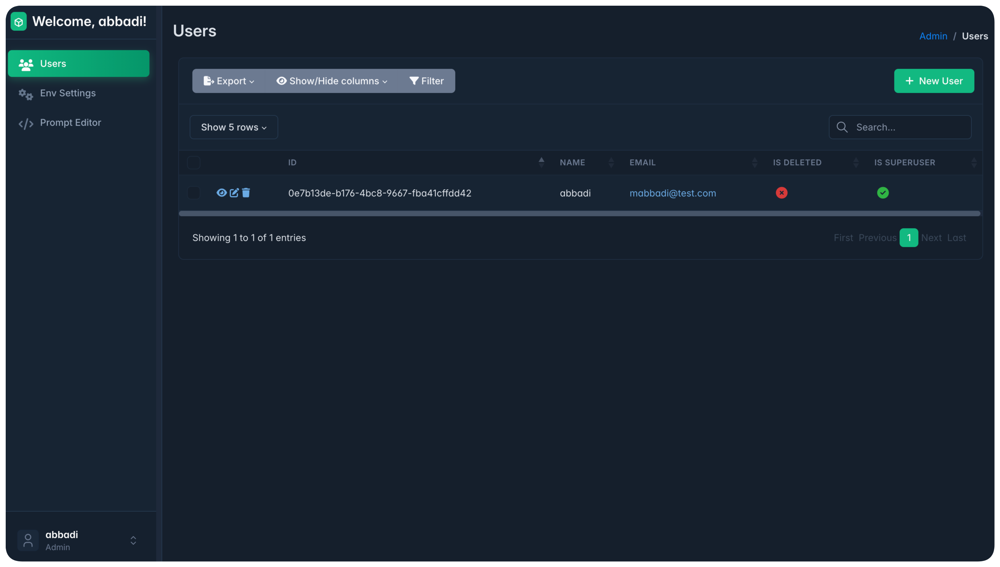
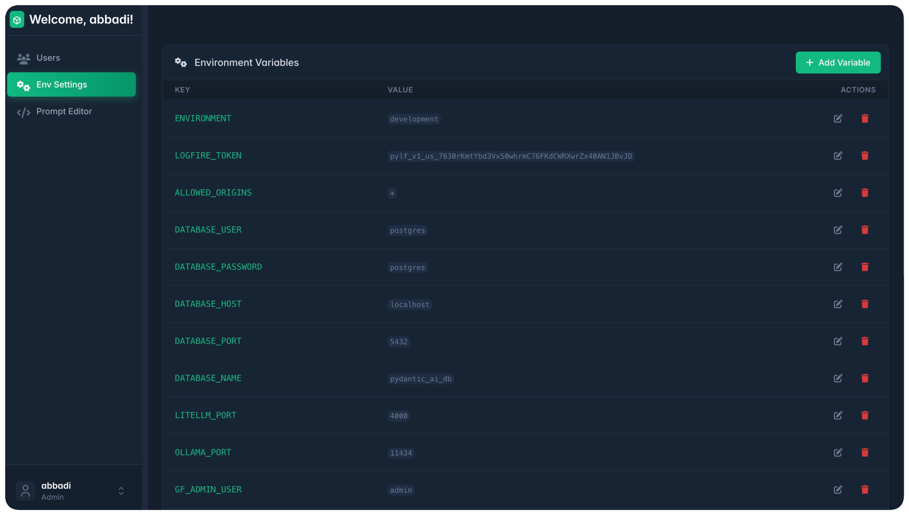
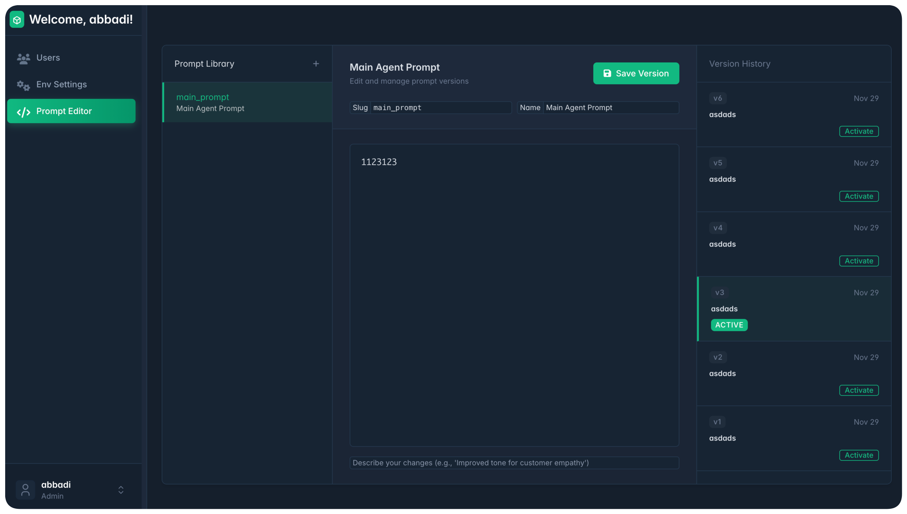

# Pydantic AI Production Ready Template

A production-ready template for building applications with Pydantic AI, FastAPI, and modern Python tooling.

## Requirements

- Python >= 3.13
- [uv](https://github.com/astral-sh/uv) package manager

## Installation

Install project dependencies:

```bash
make install
```

For development, install with dev dependencies:

```bash
make install-dev
```

## Configuration

The application uses environment-specific configuration files. Create `.env.development` for development and `.env.production` for production.

### Environment Files

The application automatically loads configuration from:
- `.env.development` when `ENVIRONMENT=development` (default)
- `.env.production` when `ENVIRONMENT=production`

### Required Environment Variables

Create your environment file (`.env.development` or `.env.production`) with the following variables:

#### 1. Logfire Token (Required)

Configure Logfire for observability and monitoring:

1. Sign in to https://logfire.pydantic.dev
2. Go to **Projects**
3. Click **New project**
4. Add project name and select visibility to **Private**
5. After this you will be redirected to **Settings** page of the project you have created
6. Go to **Write tokens** and press on **"New write token"** to create a new token
7. Copy the token and add it to your `.env.development/production` file as:

```bash
LOGFIRE_TOKEN=your_token_here
```

#### 2. JWT Configuration (Optional)

JWT settings (defaults provided, but recommended to set in production):

```bash
JWT_SECRET_KEY=your_secret_key_here  # Auto-generated if not provided
JWT_ALGORITHM=HS256
ACCESS_TOKEN_EXPIRE_MINUTES=30
```

### Database Setup

1. **Start PostgreSQL** (using Docker for development):

```bash
make docker-dev-up
```

2. **Run migrations**:

```bash
make migration-upgrade
```

3. **Create a superuser**:

```bash
make createsuperuser
```

### Security Notes

- **Never commit** `.env.development` or `.env.production` files to version control
- Use strong, unique passwords in production
- Generate secure `JWT_SECRET_KEY` for production (use `secrets.token_hex(32)` or similar)
- Restrict `ALLOWED_ORIGINS` in production to your actual domains
- Keep `DEBUG=false` in production

## Development Setup

### Pre-commit Hooks

Pre-commit won't run automatically until you actually install the hooks into `.git/hooks`. Run the installer once (it's not in git history) so Git knows to invoke them:

```bash
uv run pre-commit install --hook-type pre-commit --hook-type commit-msg
```

After that, every `git commit` will trigger the lint/format checks plus the Commitizen commit-msg hook from your `.pre-commit-config.yaml`. If you ever need to lint everything manually, use:

```bash
uv run pre-commit run --all-files
```

Alternatively, you can use the Makefile targets:

```bash
make pre-commit-install  # Install pre-commit hooks
make pre-commit-run      # Run pre-commit hooks on all files
```

## Available Commands

Run `make help` to see all available commands, or use:

### Installation
- `make install` - Install project dependencies
- `make install-dev` - Install project dependencies including dev dependencies

### Running the Application
- `make run` - Run the application in production mode
- `make run-dev` - Run the application in development mode with auto-reload

### Code Quality
- `make format` - Format code using Ruff
- `make test` - Run tests using pytest
- `make test-cov` - Run tests with coverage report
- `make pre-commit-install` - Install pre-commit hooks
- `make pre-commit-run` - Run pre-commit hooks on all files

### Database Management
- `make migration-create MESSAGE="message"` - Create a new migration
- `make migration-upgrade` - Upgrade database to the latest migration
- `make migration-downgrade` - Downgrade database by one revision
- `make migration-current` - Show current database revision
- `make migration-history` - Show migration history
- `make createsuperuser` - Create a superuser account (interactive)

### Docker Services
- `make docker-dev-up` - Start development Docker services
- `make docker-dev-down` - Stop development Docker services
- `make docker-dev-logs` - View development Docker services logs
- `make docker-dev-restart` - Restart development Docker services
- `make docker-up` - Start production Docker services
- `make docker-down` - Stop production Docker services
- `make docker-logs` - View production Docker services logs
- `make docker-restart` - Restart production Docker services

## Admin Panel

The application includes a built-in admin panel for managing prompts, users, and environment variables.

### Accessing the Admin Panel

1. Start the application:
   ```bash
   make run-dev
   ```

2. Navigate to `http://localhost:8000/admin` in your browser.

3. Log in using your superuser credentials (create one using `make createsuperuser` if you haven't already).

### Features

#### Login Page
Secure authentication to access the admin panel.



#### User Management
Manage system users, roles, and permissions.



#### Environment Settings
Securely manage environment variables and configuration settings directly from the admin interface.



#### Prompt Versioning Control
Create, edit, and version control your AI prompts with commit messages and easy rollback capabilities.



## License

[Add your license here]
