```mermaid
graph TB
    User[👤 User Request] -->|HTTP Request| FastAPI[🚀 FastAPI Application]

    FastAPI --> Security[🛡️ Security Middleware]
    Security -->|Rate Limiting| Redis[💾 Redis Cache]
    Security --> Session[📝 Session Middleware]

    Session --> Auth[🔐 Authentication]
    Auth -->|Valid| Continue[✅ Continue to Agent]
    Auth -->|Invalid| Error[❌ 401 Unauthorized]

    style User fill:#e1f5ff
    style FastAPI fill:#4CAF50
    style Security fill:#FF5722
    style Redis fill:#F44336
    style Auth fill:#FF9800
    style Error fill:#F44336
    style Continue fill:#4CAF50
```

# Pydantic AI Production Ready Template

A production-ready template for building applications with Pydantic AI, FastAPI, and modern Python tooling.

## Architecture Overview

The application follows a layered architecture where user requests flow through multiple services before reaching the LLM provider. The flow is broken down into clear, manageable sections below.

### High-Level Flow


<details>
<summary><b>📥 Part 1: Request Entry & Security</b> (Click to expand)</summary>



**What happens here:**
- FastAPI receives the HTTP request
- Security middleware checks rate limits (stored in Redis)
- Session middleware manages user sessions
- JWT token is validated for authentication
- Invalid requests are rejected immediately

```mermaid
graph TB
    Agent[🤖 Pydantic AI Agent] --> PromptService[📋 Prompt Service]

    PromptService -->|1. Check Cache| Redis[💾 Redis Cache]
    Redis -->|Cache Hit| Cached[✅ Return Cached Prompt]
    Redis -->|Cache Miss| DB[(🗄️ PostgreSQL)]

    DB -->|2. Load Prompt| PromptDB[📝 Prompt Content]
    PromptDB -->|3. Store in Cache| Redis
    PromptDB -->|Return| Agent

    Cached --> Agent

    style Agent fill:#FF9800
    style PromptService fill:#2196F3
    style Redis fill:#F44336
    style DB fill:#607D8B
    style Cached fill:#4CAF50
```

</details>

<details>
<summary><b>📋 Part 2: Prompt Retrieval & Caching</b> (Click to expand)</summary>



**What happens here:**
- Agent requests a prompt by slug/identifier
- Prompt Service first checks Redis cache (fast)
- If not cached, loads from PostgreSQL database
- Caches the prompt in Redis for future requests
- Uses active version from prompt versioning system

```mermaid
graph TB
    Agent[🤖 Pydantic AI Agent] -->|Request with Prompt| LiteLLM[🔀 LiteLLM Proxy]

    LiteLLM -->|Route| Router{Select Provider}

    Router -->|OpenAI| OpenAI[OpenAI API]
    Router -->|Anthropic| Anthropic[Anthropic API]
    Router -->|Google| Google[Google API]
    Router -->|Other| Other[Other Providers]

    OpenAI -->|Response| LiteLLM
    Anthropic -->|Response| LiteLLM
    Google -->|Response| LiteLLM
    Other -->|Response| LiteLLM

    LiteLLM -->|Usage Tracking| DB[(🗄️ PostgreSQL)]
    LiteLLM -->|Response| Agent

    style Agent fill:#FF9800
    style LiteLLM fill:#2196F3
    style Router fill:#9C27B0
    style OpenAI fill:#10A37F
    style Anthropic fill:#D4A574
    style Google fill:#4285F4
    style DB fill:#607D8B
```

</details>

<details>
<summary><b>🔀 Part 3: LLM Routing via LiteLLM</b> (Click to expand)</summary>



**What happens here:**
- Agent sends the request to LiteLLM Proxy
- LiteLLM routes to the configured provider
- Handles load balancing and failover
- Tracks usage and costs in PostgreSQL
- Returns the LLM response to the agent
</details>

<details>
<summary><b>📤 Part 4: Response Flow & Observability</b> (Click to expand)</summary>


**What happens here:**
- Agent processes and structures the LLM response
- Logfire captures logs, metrics, and traces
- Response flows back through FastAPI
- User receives the final JSON response
- All metrics available in monitoring dashboard
</details>

### Key Components

- **FastAPI**: Modern, fast web framework for building APIs
- **Pydantic AI Agent**: Intelligent agent framework for LLM interactions
- **LiteLLM Proxy**: Unified interface for managing multiple LLM providers
- **PostgreSQL**: Stores prompts, versions, user data, and usage metrics
- **Redis**: Provides caching for prompts and session management
- **Logfire**: Observability platform for monitoring and debugging

## Requirements

- Python >= 3.13
- [uv](https://github.com/astral-sh/uv) package manager

## Installation

Install project dependencies:

```bash
make install
```

For development, install with dev dependencies:

```bash
make install-dev
```

## Configuration

The application uses environment-specific configuration files. Create `.env.development` for development and `.env.production` for production.

### Environment Files

The application automatically loads configuration from:
- `.env.development` when `ENVIRONMENT=development` (default)
- `.env.production` when `ENVIRONMENT=production`

### Required Environment Variables

Create your environment file (`.env.development` or `.env.production`) with the following variables:

#### 1. Logfire Token (Required)

Configure Logfire for observability and monitoring:

1. Sign in to https://logfire.pydantic.dev
2. Go to **Projects**
3. Click **New project**
4. Add project name and select visibility to **Private**
5. After this you will be redirected to **Settings** page of the project you have created
6. Go to **Write tokens** and press on **"New write token"** to create a new token
7. Copy the token and add it to your `.env.development/production` file as:

```bash
LOGFIRE_TOKEN=your_token_here
```

#### 2. JWT Configuration (Optional)

JWT settings (defaults provided, but recommended to set in production):

```bash
JWT_SECRET_KEY=your_secret_key_here  # Auto-generated if not provided
JWT_ALGORITHM=HS256
ACCESS_TOKEN_EXPIRE_MINUTES=30
```

### Database Setup

1. **Start PostgreSQL** (using Docker for development):

```bash
make docker-dev-up
```

2. **Run migrations**:

```bash
make migration-upgrade
```

3. **Create a superuser**:

```bash
make createsuperuser
```

### Security Notes

- **Never commit** `.env.development` or `.env.production` files to version control
- Use strong, unique passwords in production
- Generate secure `JWT_SECRET_KEY` for production (use `secrets.token_hex(32)` or similar)
- Restrict `ALLOWED_ORIGINS` in production to your actual domains
- Keep `DEBUG=false` in production

## Development Setup

### Pre-commit Hooks

Pre-commit won't run automatically until you actually install the hooks into `.git/hooks`. Run the installer once (it's not in git history) so Git knows to invoke them:

```bash
uv run pre-commit install --hook-type pre-commit --hook-type commit-msg
```

After that, every `git commit` will trigger the lint/format checks plus the Commitizen commit-msg hook from your `.pre-commit-config.yaml`. If you ever need to lint everything manually, use:

```bash
uv run pre-commit run --all-files
```

Alternatively, you can use the Makefile targets:

```bash
make pre-commit-install  # Install pre-commit hooks
make pre-commit-run      # Run pre-commit hooks on all files
```

### Commitizen - Conventional Commits

This project uses [Commitizen](https://commitizen-tools.github.io/commitizen/) ([GitHub](https://github.com/commitizen-tools/commitizen)) to ensure consistent and semantic commit messages following the [Conventional Commits](https://www.conventionalcommits.org/) standard.

#### Using `cz commit`

Instead of using `git commit`, use Commitizen's interactive CLI:

```bash
uv run cz commit
```

This will guide you through creating a properly formatted commit message with the following prompts:

1. **Type**: Select the type of change you are committing (e.g., `fix: A bug fix. Correlates with PATCH in SemVer`)
2. **Scope** (optional): What is the scope of this change? (class or file name) - Press Enter to skip
3. **Subject**: Write a short and imperative summary of the code changes (lower case and no period)
4. **Body** (optional): Provide additional contextual information about the code changes - Press Enter to skip
5. **Breaking Change**: Is this a BREAKING CHANGE? Correlates with MAJOR in SemVer (Yes/No)
6. **Footer** (optional): Information about Breaking Changes and reference issues that this commit closes - Press Enter to skip

#### Example Commit Flow

```bash
# Stage your changes
git add .

# Use Commitizen to create a commit
uv run cz commit

# Example interactive prompts:
# ? Select the type of change you are committing: feat
#   feat: A new feature. Correlates with MINOR in SemVer
# ? What is the scope of this change? (class or file name): (press [enter] to skip)
#   api
# ? Write a short and imperative summary of the code changes: (lower case and no period)
#   add user authentication endpoint
# ? Provide additional contextual information about the code changes: (press [enter] to skip)
#   [Enter]
# ? Is this a BREAKING CHANGE? Correlates with MAJOR in SemVer
#   No
# ? Footer. Information about Breaking Changes and reference issues that this commit closes: (press [enter] to skip)
#   [Enter]

# Result: feat(api): add user authentication endpoint
```

#### Commit Message Format

The standard format is:

```
<type>(<scope>): <subject>

<body>

<footer>
```

**Types:**
- `feat`: A new feature
- `fix`: A bug fix
- `docs`: Documentation changes
- `style`: Code style changes (formatting, missing semicolons, etc.)
- `refactor`: Code refactoring without changing functionality
- `perf`: Performance improvements
- `test`: Adding or updating tests
- `chore`: Maintenance tasks (build, CI/CD, dependencies)
- `ci`: CI/CD configuration changes
- `build`: Build system changes

**Examples:**

```bash
feat(auth): add JWT authentication
fix(database): resolve connection pool timeout
docs(readme): update installation instructions
test(api): add integration tests for health endpoint
```

#### Benefits

- ✅ Automatically validates commit messages
- ✅ Enables semantic versioning and automatic changelog generation
- ✅ Improves collaboration through clear commit history
- ✅ Enforced by pre-commit hooks (commit-msg stage)

#### Learn More

For more information about Commitizen, visit:
- **Documentation**: https://commitizen-tools.github.io/commitizen/
- **GitHub Repository**: https://github.com/commitizen-tools/commitizen
- **Conventional Commits Specification**: https://www.conventionalcommits.org/

## Available Commands

Run `make help` to see all available commands, or use:

### Installation
- `make install` - Install project dependencies
- `make install-dev` - Install project dependencies including dev dependencies

### Running the Application
- `make run` - Run the application in production mode
- `make run-dev` - Run the application in development mode with auto-reload

### Code Quality
- `make format` - Format code using Ruff
- `make test` - Run tests using pytest
- `make test-cov` - Run tests with coverage report
- `make pre-commit-install` - Install pre-commit hooks
- `make pre-commit-run` - Run pre-commit hooks on all files

### Database Management
- `make migration-create MESSAGE="message"` - Create a new migration
- `make migration-upgrade` - Upgrade database to the latest migration
- `make migration-downgrade` - Downgrade database by one revision
- `make migration-current` - Show current database revision
- `make migration-history` - Show migration history
- `make createsuperuser` - Create a superuser account (interactive)

### Docker Services
- `make docker-dev-up` - Start development Docker services
- `make docker-dev-down` - Stop development Docker services
- `make docker-dev-logs` - View development Docker services logs
- `make docker-dev-restart` - Restart development Docker services
- `make docker-up` - Start production Docker services
- `make docker-down` - Stop production Docker services
- `make docker-logs` - View production Docker services logs
- `make docker-restart` - Restart production Docker services

## Admin Panel

The application includes a built-in admin panel for managing prompts, users, and environment variables.

### Accessing the Admin Panel

1. Start the application:
   ```bash
   make run-dev
   ```

2. Navigate to `http://localhost:8000/admin` in your browser.

3. Log in using your superuser credentials (create one using `make createsuperuser` if you haven't already).

### Features

#### Login Page
Secure authentication to access the admin panel.


#### User Management
Manage system users, roles, and permissions.


#### Environment Settings
Securely manage environment variables and configuration settings directly from the admin interface.


#### Prompt Versioning Control
Create, edit, and version control your AI prompts with commit messages and easy rollback capabilities.


#### Configuring Agent Instructions with Prompt Versioning

Agent instructions are stored as prompts so you can edit them from the admin panel without changing code. The default `main_agent` uses the slug `main_agent_instructions`:

```python
@main_agent.instructions
async def main_agent_instructions(
    ctx: RunContext[MainAgentDependencies],
) -> str:
    """Main agent instructions."""
    content = await PromptService.get_cached_content(
        session=ctx.deps.session,
        redis=ctx.deps.redis,
        slug="main_agent_instructions",
    )
    return content or ""
```

To update these instructions:

1. Open the **Prompt Versioning Control** page in the admin panel.
2. Locate or create a prompt with the slug `main_agent_instructions`.
3. Edit the content and add a commit message.
4. Save (and optionally activate) the new version. The agent will now use the updated instructions. Cached content is refreshed automatically when versions change.

## Grafana Monitoring

The application includes Grafana for monitoring and observability with pre-configured dashboards for container metrics.

### Accessing Grafana

1. Start the Docker services (includes Grafana and Prometheus):
   ```bash
   make docker-dev-up
   ```

2. Navigate to `http://localhost:3000` in your browser.

3. Log in using the default credentials (or your configured credentials from `.env.development`):
   - **Username**: `admin` (or `GF_ADMIN_USER` from your env file)
   - **Password**: `admin` (or `GF_ADMIN_PASSWORD` from your env file)

### Grafana Configuration

Grafana is pre-configured with:

- **Prometheus Data Source**: Automatically configured to connect to the Prometheus service at `http://prometheus:9090`
- **Container Monitoring Dashboard**: Pre-provisioned dashboard for Docker container metrics

#### Environment Variables

Configure Grafana in your `.env.development` or `.env.production` file:

```bash
# Grafana Configuration
GF_ADMIN_USER=admin              # Grafana admin username
GF_ADMIN_PASSWORD=admin          # Grafana admin password
GF_USERS_ALLOW_SIGN_UP=false     # Disable user signup (recommended for production)
```

#### Default Port

Grafana runs on port `3000` by default. You can change this by setting the `GRAFANA_PORT` environment variable in your docker-compose configuration.

### Dashboard Features

The pre-configured dashboard provides insights into:

- Container CPU usage
- Memory consumption
- Network traffic
- Disk I/O metrics


### Customizing Dashboards

1. Log into Grafana at `http://localhost:3000`
2. Navigate to **Dashboards** in the left sidebar
3. You can edit existing dashboards or create new ones
4. Custom dashboards are stored in `./grafana/provisioning/dashboards/json/` for persistence

## LiteLLM Proxy

The application includes LiteLLM Proxy, a unified interface to manage multiple LLM providers, enabling easy model switching, cost tracking, and usage monitoring.

### Accessing LiteLLM UI

1. Start the Docker services (includes LiteLLM Proxy):
   ```bash
   make docker-dev-up
   ```

2. Navigate to `http://localhost:4000` in your browser.

3. Log in using your configured credentials from `.env.development`:
   - **Username**: `admin` (or `LITELLM_UI_USERNAME` from your env file)
   - **Password**: `password` (or `LITELLM_UI_PASSWORD` from your env file)

### LiteLLM Configuration

LiteLLM is pre-configured with:

- **PostgreSQL Database**: Stores model configurations and usage data
- **Redis Cache**: Enables response caching for improved performance
- **Cost Tracking**: Automatically tracks costs per deployment/model

#### Environment Variables

Configure LiteLLM in your `.env.development` or `.env.production` file:

```bash
# LiteLLM Configuration
LITELLM_PROXY_ADMIN_ID=admin                    # Admin user ID
LITELLM_MASTER_KEY=sk-password                  # Master key (must start with "sk-")
LITELLM_UI_USERNAME=admin                       # UI login username
LITELLM_UI_PASSWORD=password                    # UI login password
```

#### Model Configuration

The LiteLLM configuration file is located at `./litellm/litellm.yaml`. You can edit this file to add or modify model configurations.

#### Adding and Using Models

##### Step 1: Add Your Model in LiteLLM

You can add models to LiteLLM in two ways:

**Option A: Via LiteLLM UI (Recommended)**

1. Navigate to `http://localhost:4000` and log in
2. Go to **Models** section
3. Click **Add Model** or **Add Endpoint**
4. Configure your model:
   - Select the provider (OpenAI, Anthropic, Google, etc.)
   - Enter your API key
   - Set the model name (e.g., `gpt-4`, `claude-3-opus`, `gemini-pro`)
   - Configure any additional settings
5. Save the configuration

**Option B: Via Configuration File**

Edit `./litellm/litellm.yaml` and add your model configuration:

```yaml
model_list:
  - model_name: gpt-4
    litellm_params:
      model: gpt-4
      api_key: your-api-key-here
  - model_name: claude-3-opus
    litellm_params:
      model: claude-3-opus
      api_key: your-anthropic-key-here
```

After adding models via the config file (ONLY), restart the LiteLLM service:

```bash
make docker-dev-restart
```

##### Step 2: Use Your Model in Code

Once you've added your model in LiteLLM, you can use it in your agents by updating the model name in the agent definition.

For example, in `src/core/agentic_system/agents/main_agent.py`:

```python
from attr import dataclass
from pydantic_ai import Agent, ModelSettings

from src.core.agentic_system.utils import get_chat_model


@dataclass
class MainAgentDependencies:
    """Main agent dependencies."""

    user_name: str


main_agent = Agent[MainAgentDependencies, str](
    name="main_agent",
    model=get_chat_model("your-model-name-in-litellm", ModelSettings(temperature=0.3)),
    deps_type=MainAgentDependencies,
)
```

**Important Notes:**

- Replace `"your-model-name-in-litellm"` with the exact model name you configured in LiteLLM
- The model name must match exactly what you set in LiteLLM (case-sensitive)
- You can adjust `ModelSettings` parameters like `temperature`, `max_tokens`, etc.
- The `get_chat_model()` function automatically connects to your LiteLLM proxy at the configured base URL

**Example:**

If you added a model named `gpt-4` in LiteLLM, your code would look like:

```python
main_agent = Agent[MainAgentDependencies, str](
    name="main_agent",
    model=get_chat_model("gpt-4", ModelSettings(temperature=0.3)),
    deps_type=MainAgentDependencies,
)
```

### Features

#### Adding Models and Endpoints
Configure and manage LLM models from various providers (OpenAI, Anthropic, Google, etc.) and set up custom endpoints.


#### Virtual API Keys
Create and manage virtual API keys for different teams or projects, enabling usage tracking and access control.


#### Usage Tracking
Monitor usage statistics for each team or API key, including token consumption, costs, and request metrics.


### Default Port

LiteLLM Proxy runs on port `4000` by default. You can change this by setting the `LITELLM_PORT` environment variable in your docker-compose configuration.

## License

[Add your license here]
