# Pydantic AI Production Ready Template

A production-ready template for building applications with Pydantic AI, FastAPI, and modern Python tooling.

## Architecture Overview

The application follows a layered architecture where user requests flow through multiple services before reaching the LLM provider. Below is a detailed diagram showing how a request is processed:

```mermaid
graph TB
    User[👤 User Request] -->|HTTP Request| FastAPI[🚀 FastAPI Application]

    FastAPI --> Security[🛡️ Security Middleware]
    Security -->|Rate Limiting| RedisCache[💾 Redis Cache]
    Security -->|Session Management| Session[📝 Session Middleware]

    Session --> Auth[🔐 Authentication/Authorization]
    Auth -->|Valid Token| Agent[🤖 Pydantic AI Agent]
    Auth -->|Invalid| Error1[❌ 401 Unauthorized]

    Agent --> PromptService[📋 Prompt Service]
    PromptService -->|Check Cache| RedisCache
    RedisCache -->|Cache Hit| PromptCache[✅ Cached Prompt]
    RedisCache -->|Cache Miss| Database[(🗄️ PostgreSQL Database)]

    Database -->|Load Prompt| PromptDB[📝 Prompt Content]
    PromptDB -->|Store in Cache| RedisCache
    PromptDB --> PromptCache

    PromptCache --> Agent
    Agent -->|Configured with Model| LiteLLM[🔀 LiteLLM Proxy]

    LiteLLM -->|Route Request| LLMProvider[🤖 Main LLM Provider]
    LLMProvider -->|OpenAI| OpenAI[OpenAI API]
    LLMProvider -->|Anthropic| Anthropic[Anthropic API]
    LLMProvider -->|Google| Google[Google API]
    LLMProvider -->|Other| Other[Other Providers]

    OpenAI -->|Response| LiteLLM
    Anthropic -->|Response| LiteLLM
    Google -->|Response| LiteLLM
    Other -->|Response| LiteLLM

    LiteLLM -->|Usage Tracking| Database
    LiteLLM -->|Response| Agent

    Agent -->|Process Response| Logfire[📊 Logfire Observability]
    Logfire -->|Logs & Metrics| Monitoring[📈 Monitoring Dashboard]

    Agent -->|Final Response| FastAPI
    FastAPI -->|JSON Response| User

    style User fill:#e1f5ff
    style FastAPI fill:#4CAF50
    style Agent fill:#FF9800
    style LiteLLM fill:#2196F3
    style LLMProvider fill:#9C27B0
    style Database fill:#607D8B
    style RedisCache fill:#F44336
    style Logfire fill:#FFC107
```



### Request Flow Explanation

1. **User Request** → A client sends an HTTP request to the FastAPI application endpoint.

2. **FastAPI Application** → Receives the request and applies middleware layers:
   - **Security Middleware**: Implements rate limiting, blocks malicious user agents, and provides CORS protection
   - **Session Middleware**: Manages user sessions securely
   - **Redis Cache**: Used for rate limiting and session storage

3. **Authentication/Authorization** → Validates the user's JWT token:
   - If valid: Proceeds to the agent
   - If invalid: Returns `401 Unauthorized`

4. **Pydantic AI Agent** → The core agent that processes user requests:
   - Retrieves prompts from the Prompt Service
   - Configures the LLM model via LiteLLM
   - Handles conversation context and state

5. **Prompt Service** → Manages prompt loading and caching:
   - **Cache Check**: First checks Redis for cached prompts (fast retrieval)
   - **Database Fallback**: If cache miss, loads from PostgreSQL
   - **Cache Update**: Stores loaded prompts in Redis for future requests
   - **Version Control**: Uses active prompt versions managed via the admin panel

6. **LiteLLM Proxy** → Acts as a unified interface to multiple LLM providers:
   - Routes requests to the configured provider
   - Handles load balancing and failover
   - Tracks usage and costs per deployment
   - Manages API keys and rate limits

7. **Main LLM Provider** → The actual LLM service (OpenAI, Anthropic, Google, etc.):
   - Processes the prompt and generates a response
   - Returns the completion to LiteLLM

8. **Response Flow** → The response flows back through the system:
   - LiteLLM tracks usage metrics in PostgreSQL
   - Agent processes and structures the response
   - Logfire captures observability data (logs, traces, metrics)
   - FastAPI returns the final JSON response to the user

### Key Components

- **FastAPI**: Modern, fast web framework for building APIs
- **Pydantic AI Agent**: Intelligent agent framework for LLM interactions
- **LiteLLM Proxy**: Unified interface for managing multiple LLM providers
- **PostgreSQL**: Stores prompts, versions, user data, and usage metrics
- **Redis**: Provides caching for prompts and session management
- **Logfire**: Observability platform for monitoring and debugging

## Requirements

- Python >= 3.13
- [uv](https://github.com/astral-sh/uv) package manager

## Installation

Install project dependencies:

```bash
make install
```

For development, install with dev dependencies:

```bash
make install-dev
```

## Configuration

The application uses environment-specific configuration files. Create `.env.development` for development and `.env.production` for production.

### Environment Files

The application automatically loads configuration from:
- `.env.development` when `ENVIRONMENT=development` (default)
- `.env.production` when `ENVIRONMENT=production`

### Required Environment Variables

Create your environment file (`.env.development` or `.env.production`) with the following variables:

#### 1. Logfire Token (Required)

Configure Logfire for observability and monitoring:

1. Sign in to https://logfire.pydantic.dev
2. Go to **Projects**
3. Click **New project**
4. Add project name and select visibility to **Private**
5. After this you will be redirected to **Settings** page of the project you have created
6. Go to **Write tokens** and press on **"New write token"** to create a new token
7. Copy the token and add it to your `.env.development/production` file as:

```bash
LOGFIRE_TOKEN=your_token_here
```

#### 2. JWT Configuration (Optional)

JWT settings (defaults provided, but recommended to set in production):

```bash
JWT_SECRET_KEY=your_secret_key_here  # Auto-generated if not provided
JWT_ALGORITHM=HS256
ACCESS_TOKEN_EXPIRE_MINUTES=30
```

### Database Setup

1. **Start PostgreSQL** (using Docker for development):

```bash
make docker-dev-up
```

2. **Run migrations**:

```bash
make migration-upgrade
```

3. **Create a superuser**:

```bash
make createsuperuser
```

### Security Notes

- **Never commit** `.env.development` or `.env.production` files to version control
- Use strong, unique passwords in production
- Generate secure `JWT_SECRET_KEY` for production (use `secrets.token_hex(32)` or similar)
- Restrict `ALLOWED_ORIGINS` in production to your actual domains
- Keep `DEBUG=false` in production

## Development Setup

### Pre-commit Hooks

Pre-commit won't run automatically until you actually install the hooks into `.git/hooks`. Run the installer once (it's not in git history) so Git knows to invoke them:

```bash
uv run pre-commit install --hook-type pre-commit --hook-type commit-msg
```

After that, every `git commit` will trigger the lint/format checks plus the Commitizen commit-msg hook from your `.pre-commit-config.yaml`. If you ever need to lint everything manually, use:

```bash
uv run pre-commit run --all-files
```

Alternatively, you can use the Makefile targets:

```bash
make pre-commit-install  # Install pre-commit hooks
make pre-commit-run      # Run pre-commit hooks on all files
```

## Available Commands

Run `make help` to see all available commands, or use:

### Installation
- `make install` - Install project dependencies
- `make install-dev` - Install project dependencies including dev dependencies

### Running the Application
- `make run` - Run the application in production mode
- `make run-dev` - Run the application in development mode with auto-reload

### Code Quality
- `make format` - Format code using Ruff
- `make test` - Run tests using pytest
- `make test-cov` - Run tests with coverage report
- `make pre-commit-install` - Install pre-commit hooks
- `make pre-commit-run` - Run pre-commit hooks on all files

### Database Management
- `make migration-create MESSAGE="message"` - Create a new migration
- `make migration-upgrade` - Upgrade database to the latest migration
- `make migration-downgrade` - Downgrade database by one revision
- `make migration-current` - Show current database revision
- `make migration-history` - Show migration history
- `make createsuperuser` - Create a superuser account (interactive)

### Docker Services
- `make docker-dev-up` - Start development Docker services
- `make docker-dev-down` - Stop development Docker services
- `make docker-dev-logs` - View development Docker services logs
- `make docker-dev-restart` - Restart development Docker services
- `make docker-up` - Start production Docker services
- `make docker-down` - Stop production Docker services
- `make docker-logs` - View production Docker services logs
- `make docker-restart` - Restart production Docker services

## Admin Panel

The application includes a built-in admin panel for managing prompts, users, and environment variables.

### Accessing the Admin Panel

1. Start the application:
   ```bash
   make run-dev
   ```

2. Navigate to `http://localhost:8000/admin` in your browser.

3. Log in using your superuser credentials (create one using `make createsuperuser` if you haven't already).

### Features

#### Login Page
Secure authentication to access the admin panel.


#### User Management
Manage system users, roles, and permissions.


#### Environment Settings
Securely manage environment variables and configuration settings directly from the admin interface.


#### Prompt Versioning Control
Create, edit, and version control your AI prompts with commit messages and easy rollback capabilities.


## Grafana Monitoring

The application includes Grafana for monitoring and observability with pre-configured dashboards for container metrics.

### Accessing Grafana

1. Start the Docker services (includes Grafana and Prometheus):
   ```bash
   make docker-dev-up
   ```

2. Navigate to `http://localhost:3000` in your browser.

3. Log in using the default credentials (or your configured credentials from `.env.development`):
   - **Username**: `admin` (or `GF_ADMIN_USER` from your env file)
   - **Password**: `admin` (or `GF_ADMIN_PASSWORD` from your env file)

### Grafana Configuration

Grafana is pre-configured with:

- **Prometheus Data Source**: Automatically configured to connect to the Prometheus service at `http://prometheus:9090`
- **Container Monitoring Dashboard**: Pre-provisioned dashboard for Docker container metrics

#### Environment Variables

Configure Grafana in your `.env.development` or `.env.production` file:

```bash
# Grafana Configuration
GF_ADMIN_USER=admin              # Grafana admin username
GF_ADMIN_PASSWORD=admin          # Grafana admin password
GF_USERS_ALLOW_SIGN_UP=false     # Disable user signup (recommended for production)
```

#### Default Port

Grafana runs on port `3000` by default. You can change this by setting the `GRAFANA_PORT` environment variable in your docker-compose configuration.

### Dashboard Features

The pre-configured dashboard provides insights into:

- Container CPU usage
- Memory consumption
- Network traffic
- Disk I/O metrics


### Customizing Dashboards

1. Log into Grafana at `http://localhost:3000`
2. Navigate to **Dashboards** in the left sidebar
3. You can edit existing dashboards or create new ones
4. Custom dashboards are stored in `./grafana/provisioning/dashboards/json/` for persistence

## LiteLLM Proxy

The application includes LiteLLM Proxy, a unified interface to manage multiple LLM providers, enabling easy model switching, cost tracking, and usage monitoring.

### Accessing LiteLLM UI

1. Start the Docker services (includes LiteLLM Proxy):
   ```bash
   make docker-dev-up
   ```

2. Navigate to `http://localhost:4000` in your browser.

3. Log in using your configured credentials from `.env.development`:
   - **Username**: `admin` (or `LITELLM_UI_USERNAME` from your env file)
   - **Password**: `password` (or `LITELLM_UI_PASSWORD` from your env file)

### LiteLLM Configuration

LiteLLM is pre-configured with:

- **PostgreSQL Database**: Stores model configurations and usage data
- **Redis Cache**: Enables response caching for improved performance
- **Cost Tracking**: Automatically tracks costs per deployment/model

#### Environment Variables

Configure LiteLLM in your `.env.development` or `.env.production` file:

```bash
# LiteLLM Configuration
LITELLM_PROXY_ADMIN_ID=admin                    # Admin user ID
LITELLM_MASTER_KEY=sk-password                  # Master key (must start with "sk-")
LITELLM_UI_USERNAME=admin                       # UI login username
LITELLM_UI_PASSWORD=password                    # UI login password
```

#### Model Configuration

The LiteLLM configuration file is located at `./litellm/litellm.yaml`. You can edit this file to add or modify model configurations.

### Features

#### Adding Models and Endpoints
Configure and manage LLM models from various providers (OpenAI, Anthropic, Google, etc.) and set up custom endpoints.


#### Virtual API Keys
Create and manage virtual API keys for different teams or projects, enabling usage tracking and access control.


#### Usage Tracking
Monitor usage statistics for each team or API key, including token consumption, costs, and request metrics.


### Default Port

LiteLLM Proxy runs on port `4000` by default. You can change this by setting the `LITELLM_PORT` environment variable in your docker-compose configuration.

## License

[Add your license here]
